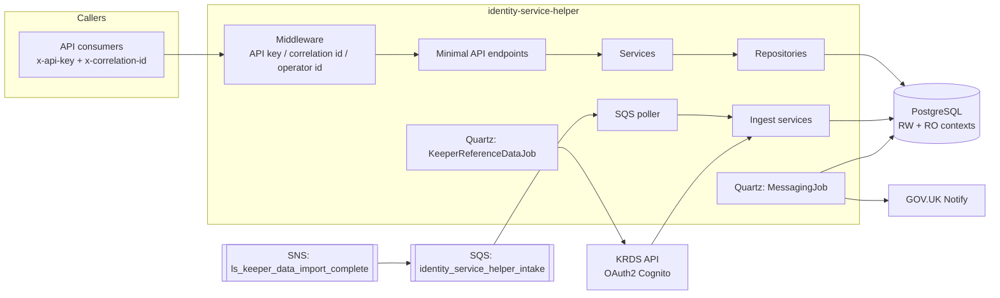

# Identity Service Helper — Runbook

Operational runbook for the **identity-service-helper** microservice.

| | |
|---|---|
| **Service** | identity-service-helper |
| **Platform** | Defra Core Delivery Platform (CDP) |
| **Runtime** | .NET 10 / ASP.NET Core minimal APIs |
| **Data store** | PostgreSQL 16 (AWS Aurora RDS in deployed environments) |
| **Container entrypoint** | `dotnet Defra.Identity.Api.dll` (see [Dockerfile](../../Dockerfile)) |
| **Health endpoint** | `GET /health` (no auth headers required) |

Related documents:

- [Configuration reference](configuration.md) — every setting, environment variable and secret.
- [API reference](api-reference.md) — full endpoint catalogue with headers, bodies and status codes.
- [Troubleshooting](troubleshooting.md) — symptom → cause → resolution.
- [README](../../README.md) — local development, testing and migration workflow.

---

## 1. What this service does

Identity Service Helper is a CDP-style backend service that owns identity and land-holding
authorisation data for keeper (livestock) services. It:

- exposes a **JSON HTTP API** (snake_case) over its PostgreSQL data, secured with an API key;
- synchronises **Keeper Reference Data** (sites/CPHs, roles) from the external **KRDS** API;
- consumes **AWS SQS** messages (`ls_keeper_data_import_complete`) that trigger data ingest;
- runs **Quartz scheduled jobs** for the KRDS sync and outbound-message dispatch;
- sends **email/SMS** through GOV.UK Notify using an outbox table (`external_messaging`).

Domain resources managed by the API: users, applications (client registrations), roles,
CPHs (County Parish Holdings), CPH delegations of authority, and animal species.

## 2. Architecture

Layered solution under [src/](../../src/):

| Project | Responsibility |
|---|---|
| [Api](../../src/Api/) | ASP.NET Core host: endpoints, middleware (API key / correlation id / operator id), validation, error handling |
| [Services](../../src/Services/) | Business logic per domain (users, applications, CPHs, delegations, species, profiles, roles) |
| [Models](../../src/Models/) | Request/response contracts + FluentValidation validators |
| [Repositories](../../src/Repositories/) | Data-access abstractions over EF Core |
| [Database/Postgres.Database](../../src/Database/Postgres.Database/) | EF Core `PostgresDbContext` (read-write) and `ReadOnlyPostgresDbContext` (no-tracking), Npgsql data sources, optional RDS IAM auth |
| [Database/DataSeeder](../../src/Database/DataSeeder/) | CLI tool that runs SQL scripts against a PostgreSQL instance |
| [Integrations/Krds](../../src/Integrations/Krds/) | KRDS REST client + OAuth2 (Cognito) token acquisition |
| [Integrations/Queues](../../src/Integrations/Queues/) | SQS intake poller and message handlers |
| [Integrations/Schedules](../../src/Integrations/Schedules/) | Quartz job definitions and scheduling |
| [Integrations/Messaging](../../src/Integrations/Messaging/) | GOV.UK Notify dispatch from the `external_messaging` outbox |
| [Integrations/Ingest](../../src/Integrations/Ingest/) | Maps and loads externally fetched data into the database |



### Request pipeline

Order from [Program.cs](../../src/Api/Program.cs): Serilog request logging → header propagation →
exception handler → routing → custom middleware → endpoint.

Custom middleware (all in [src/Api/Middleware/](../../src/Api/Middleware/)):

1. `ApiKeyValidationMiddleware` — requires header `x-api-key` matching config `DefraIdentityApiKey`; skipped for endpoints marked `IgnoreApiKeyCheck` (only `/health`).
2. `CorrelationIdMiddleware` — requires non-empty `x-correlation-id`; skipped for `IgnoreCorrelationIdCheck` (only `/health`).
3. `OperatorIdMiddleware` — for endpoints marked `RequiresOperatorId` (all mutations), requires `x-operator-id` to be a valid GUID; the value is recorded for auditing.

Header failures return `400` with a JSON `error` envelope; unhandled exceptions return RFC 7807
problem details — see [troubleshooting](troubleshooting.md#error-response-formats).

## 3. Runtime dependencies

| Dependency | Used for | Failure impact |
|---|---|---|
| **PostgreSQL** (RDS Aurora; `PostgresConfiguration` + `ConnectionStrings`) | All persistent data. Separate read-write and read-only connections; optional IAM token auth | API returns 500s; jobs fail. EF retries transient errors 5× (max 10 s delay, 60 s command timeout) |
| **KRDS API** (`KrdsApi` config, OAuth2 client-credentials via Cognito) | Weekly sites sync + ingest after import-complete messages | Sync job logs failure and continues; data becomes stale. Sync attempts audited in `krds_sync_logs` |
| **AWS SQS** (`QueueOptions:IntakeQueueOptions`) | Receives `ls_keeper_data_import_complete` (fan-out from SNS) | Ingest is not triggered; messages accumulate on the queue |
| **GOV.UK Notify** (`Email` config) | Email/SMS dispatch from the `external_messaging` outbox | Messages remain queued in the outbox with error responses recorded |

## 4. Background processing

All background work runs **in-process** — there is no separate worker deployment.
Restarting the service restarts all of it.

| Worker | Trigger | What it does | Log signature |
|---|---|---|---|
| `KeeperReferenceDataJob` ([source](../../src/Integrations/Schedules/Scheduling/Jobs/KeeperReferenceDataJob.cs)) | Quartz cron `Scheduling:KeeperReferenceData:Cron` — default `0 0 0 ? * SUN` (weekly, Sunday 00:00 UTC) | Fetches KRDS sites changed in the last 24 h via `ISitesProvider` | `KeeperReferenceDataJob starting …` then `… succeeded, found N sites` / `… failed` |
| `MessagingJob` ([source](../../src/Integrations/Schedules/Scheduling/Jobs/MessagingJob.cs)) | Quartz cron `Scheduling:Messaging:Cron` — default `0/15 * * * * ?` (every 15 s) | Processes pending rows in the `external_messaging` outbox and dispatches via GOV.UK Notify | `Processed Email X-S, Y-F, Text Z-S, W-F` |
| SQS intake poller ([source](../../src/Integrations/Queues/QueueManagement/ServiceCollectionExtensions.cs)) | Long-polls `QueueOptions:IntakeQueueOptions:Url` (wait 20 s) | On `ls_keeper_data_import_complete`, runs CPH and Roles ingest ([handler](../../src/Integrations/Queues/QueueManagement/Handlers/KeeperDataImportCompleteHandler.cs)); returns Failed (message retried) if either ingest fails | `Processing KeeperDataImportComplete message.` |

Notes:

- Both Quartz jobs are `[DisallowConcurrentExecution]` — a slow run delays the next, it never overlaps.
- **Startup fails** with `Cron expression is missing for <section>` if either `Scheduling` cron is absent.
- Quartz waits for running jobs to complete on shutdown (`WaitForJobsToComplete = true`).
- The `PolledServices:AzureB2CSyncService` section in appsettings has **no code references** in this repository (legacy configuration; nothing runs it).

## 5. Build and deployment

### Build

- Cake script [build.cake](../../build.cake): targets `Clean`, `Restore`, `Build`, `Test` (Coverlet → `coverage/*.cobertura.xml` + ReportGenerator HTML in `coverage/reports/`), `Publish` (→ `./artifacts`), `Sonar` (full SonarCloud pipeline), `Default` (clean→restore→build→test→publish).
- [Dockerfile](../../Dockerfile): `mcr.microsoft.com/dotnet/sdk:10.0` build stage → `dotnet publish src/Api` → `mcr.microsoft.com/dotnet/aspnet:10.0` runtime with `curl` (CDP health-check requirement) and `supervisor`. `ASPNETCORE_FORWARDEDHEADERS_ENABLED=true`. Exposes 80, 443, 8085; local compose runs the app on 8080 via `PORT`.

### CI/CD ([.github/workflows/](../../.github/workflows/))

| Workflow | Trigger | Action |
|---|---|---|
| [check-pull-request.yml](../../.github/workflows/check-pull-request.yml) | PR to `main` | SonarCloud scan, then Cake `Default` (build + all tests — Docker-backed Testcontainers included) |
| [check-schema.yml](../../.github/workflows/check-schema.yml) | PR | Validates the Liquibase changelog |
| [publish.yml](../../.github/workflows/publish.yml) | Push to `main` | SonarCloud, then `DEFRA/cdp-build-action/build` (container build/publish) and `DEFRA/cdp-build-action/publish-db-migrations` with `path: ./changelog` |
| [publish-hotfix.yml](../../.github/workflows/publish-hotfix.yml) | Manual | Hotfix variant of the CDP build |
| [sonarcloud.yml](../../.github/workflows/sonarcloud.yml) | Reusable | Runs Cake `Sonar` target (project `DEFRA_identity-service-helper`, org `defra`) |

AWS context used by publish: region `eu-west-2`, account `094954420758`.
Deployments and environment promotion are performed through the CDP Portal
(see [CDP local environment repo](https://github.com/DEFRA/cdp-local-environment) for the wider setup).

### Database migrations

Schema is owned by **Liquibase** ([changelog/db.changelog.xml](../../changelog/db.changelog.xml)); EF Core
migrations are used only to *author* SQL locally — see the
[README migration workflow](../../README.md#how-to-create-database-migrations).

- In CI, migrations are published as an artefact by `publish-db-migrations` and applied via the CDP platform.
- Locally, Compose runs a `liquibase/liquibase:5.0.1` container before the app starts (`update --context-filter=default`).
- Manual run (settings from [changelog/liquibase.properties](../../changelog/liquibase.properties)):

  ```bash
  cd changelog
  liquibase update
  ```

## 6. Health and observability

- **Health**: `GET /health` → `200 {"status":"ok"}` ([HealthEndpoints.cs](../../src/Api/Endpoints/Health/HealthEndpoints.cs)). No API key or correlation id needed — safe for platform probes. It confirms the process is serving HTTP; it does **not** check the database or downstream systems.
- **Logs**: Serilog to stdout in **ECS (Elastic Common Schema) JSON** in deployed environments ([CdpLogging.cs](../../src/Api/Utility/Logging/CdpLogging.cs)); human-readable template in Development. Every request is logged (`UseSerilogRequestLogging`).
- **Correlation**: logs are enriched with the correlation id taken from the `TraceHeader` config header (`x-cdp-request-id`), and `service.version` from the `SERVICE_VERSION` environment variable. The API additionally requires `x-correlation-id` on requests, and the exception handler pushes `CorrelationId`, `TraceId`, `Path` and `StatusCode` into log context.
- **Header propagation**: the configured trace header is forwarded on outbound HTTP calls made with the default client.
- **Job audit trails**: `krds_sync_logs` table records each KRDS fetch (endpoint, HTTP status, success flag, correlation id); `external_messaging` records Notify dispatch results per message.

## 7. Routine operational tasks

### Run / restart locally

```bash
docker compose up --build -d      # full stack: LocalStack, Redis, Postgres, Liquibase, API on :8080
# or against already-running dependencies:
dotnet run --project ./src/Api --launch-profile Development
```

The override file ([compose.override.yml](../../compose.override.yml)) maps the API to **:3001**,
LocalStack to **:4567**, and requires a pre-existing external Docker network `identity-services`.

### Verify the service is up

```bash
curl http://localhost:8080/health          # {"status":"ok"}
curl -H "x-api-key: test" -H "x-correlation-id: manual-check" http://localhost:8080/roles
```

### Check migration state

```sql
SELECT id, author, filename, dateexecuted, exectype
FROM public.databasechangelog ORDER BY dateexecuted DESC LIMIT 10;
```

### Inspect the message outbox

```sql
-- Messages not yet dispatched to GOV.UK Notify (and any recorded errors)
SELECT id, message_type, message_recipient, sent_at, response_code, exception_message
FROM external_messaging WHERE sent_at IS NULL;
```

### Inspect KRDS sync history

```sql
SELECT source_endpoint, http_status, processed_ok, message, received_at
FROM krds_sync_logs ORDER BY received_at DESC LIMIT 20;
```

### Check the intake queue (local)

```bash
awslocal sqs get-queue-attributes \
  --queue-url http://localhost:4566/000000000000/identity_service_helper_intake \
  --attribute-names ApproximateNumberOfMessages
```

### Seed / run ad-hoc SQL

```bash
cd src/Database/DataSeeder
dotnet run -- run -db postgresql://localhost:5432/identity_service_helper \
  -uid identity_service_helper_ddl -pwd postgres \
  -script ../../../changelog/schema/testcontainer.postgresql.sql
```

### Run tests

```bash
dotnet test            # Docker must be running (Testcontainers-based DB tests)
```

## 8. API summary

All routes require `x-api-key` and `x-correlation-id`; mutations (POST/PUT/DELETE) additionally
require `x-operator-id` (GUID). JSON bodies and responses use **snake_case**.
Full details per endpoint: [API reference](api-reference.md).

| Resource | Routes |
|---|---|
| Health | `GET /health` *(no headers required)* |
| Users | `GET/POST /users`, `GET/PUT/DELETE /users/{id}`, `GET /users/{id}/profile` |
| Applications | `GET/POST /applications`, `GET/PUT/DELETE /applications/{id}` |
| Roles | `GET /roles` |
| CPHs | `GET /cphs` (paged), `GET/DELETE /cphs/{id}`, `GET/DELETE /cphs/{county}/{parish}/{holding}`, `POST /cphs/{…}:expire` |
| Delegations | `GET/POST /delegations`, `GET/DELETE /delegations/{id}`, `POST /delegations/{id}:accept\|:reject\|:revoke\|:expire` |
| Animal species | `GET /animal-species`, `GET /animal-species/{id}`, `POST /animal-species/{id}:toggle` |
